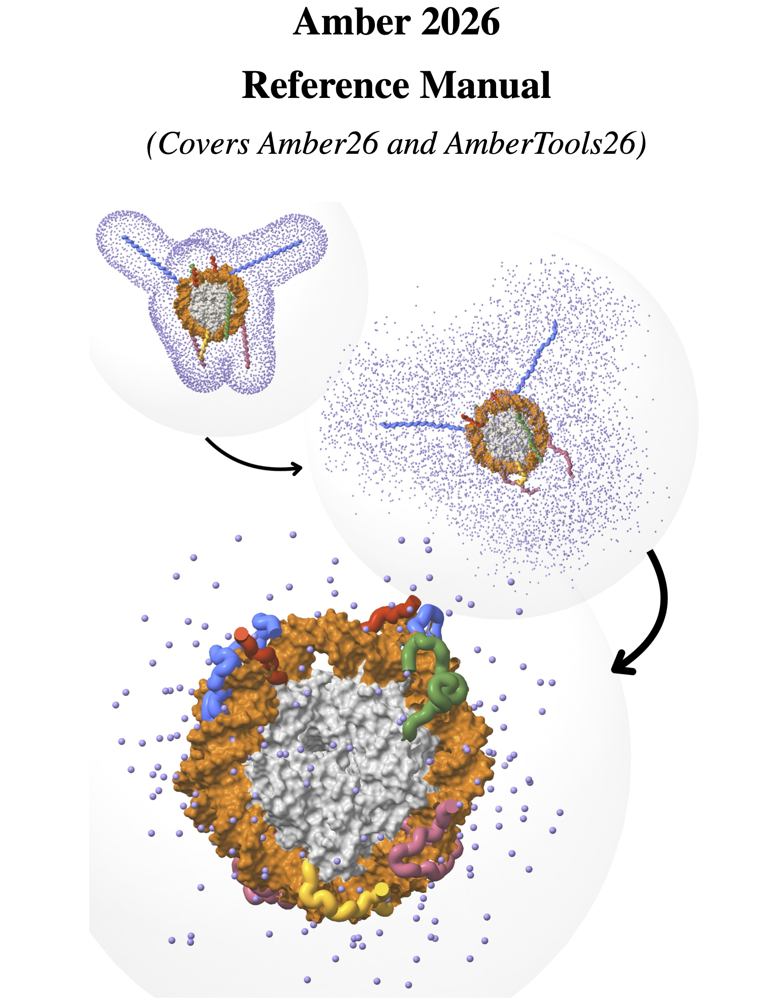

<div align="center">

# AmberTools 2026 · Code-Writing Skill

> *官方手册蒸馏 · 35 章结构化知识库 · 从命令速查到完整 MD 工作流*
>
> `AmberTools26 / Amber26` · `分子动力学模拟` · `代码优先` · `全量可溯源`

[](https://ambermd.org/Manuals.php)
[](https://claude.ai/code)
[](chapters/)
[](TUTORIALS.md)
[](#知识体系)




<br>

**Amber 2026 Reference Manual (1112 页) + 83 个官方教程的完整蒸馏 —— 以代码为中心的技术参考**

手册为骨 · 教程为肉 · 全量可溯源 · 精确到 flag 级别

</div>

---

## 目录

- [概述](#概述)
- [知识体系](#知识体系)
- [仓库结构](#仓库结构)
- [安装与使用](#安装与使用)
- [查询路由](#查询路由)
- [每章结构](#每章结构)
- [两大知识源](#两大知识源)
- [可溯源性](#可溯源性)
- [使用路径建议](#使用路径建议)

---

## 概述

本仓库将 [Amber 2026 Reference Manual (1112 页 PDF)](https://ambermd.org/Manuals.php) 与 [ambermd.org/tutorials](https://ambermd.org/tutorials/) 的 **83 个官方教程** 蒸馏为一个**统一的、结构化的** Claude Code Skill 知识库，覆盖从 PDB 准备、力场选择、LEaP 系统构建，到 sander/pmemd 分子动力学模拟、cpptraj 轨迹分析、自由能计算、增强采样、QM/MM 的完整计算化学工具链 —— 共 **35 章**。

**核心设计理念**：这是一个**代码编写技能**，而非理论教材。每章以「如何用」为核心，精确到 flag 和 namelist 变量级别，代码优先、参数全表、反模式标注、可溯源至原始手册页码和教程文件。

| 数据源 | 角色 | 规模 | 特色 |
|--------|------|------|------|
| Amber 2026 Reference Manual | 骨架 —— 完整 API 参考、namelist 变量全表、方法论 | 1112 页 | 按程序和功能组织，涵盖 sander/pmemd/cpptraj 等 20+ 程序 |
| 官方教程 (83 篇) | 血肉 —— 可复用 MD 工作流 | 83 个 Markdown | 分步实操，完整 input files，可执行命令序列 |

---

## 知识体系

### 全景图

```
┌──────────────────────────────────────────────────────────────────────────┐
│                  AmberTools 2026 · Code-Writing Skill                     │
│                    35 章 · 全量可溯源 · 精确到 flag 级别                    │
├──────────────────┬───────────────────────┬───────────────────────────────┤
│  核心 MD 工作流 (9 章) │  自由能与增强采样 (9 章)  │  专项系统与方法 (10 章)          │
├──────────────────┼───────────────────────┼───────────────────────────────┤
│ Ch  1 安装与快速入门  │ Ch 11 热力学积分 TI       │ Ch 16 力场开发 (mdgx/RESP)       │
│ Ch  2 力场参考       │ Ch 12 MM-PBSA/MMPBSA.py  │ Ch 17 金属离子建模 (MCPB/pyMSMT)    │
│ Ch  3 LEaP 系统构建  │ Ch 13 伞形采样 & NFE      │ Ch 18 膜系统 (PACKMOL-Memgen)      │
│ Ch  4 PDB 准备       │ Ch 14 增强采样 (REMD/GaMD)│ Ch 19 QM/MM 概述                  │
│ Ch  5 Antechamber/GAFF│ Ch 15 恒定 pH & 氧化还原  │ Ch 20 隐式溶剂 (GB/PBSA/RISM)     │
│ Ch  6 parmed 拓扑操作 │ Ch 28 BAR/PBSA 后处理     │ Ch 21 高级工具 (FEW/GIST/APR/EMIL) │
│ Ch  7 sander 完整参考 │ Ch 35 自由能完整方法论     │ Ch 22 NMR/CryoEM/SAXS            │
│ Ch  8 优化与弛豫      │                        │                                  │
│ Ch  9 pmemd & 生产 MD │                        │                                  │
├──────────────────┼───────────────────────┼───────────────────────────────┤
│  轨迹分析 (1 章)     │  独立程序 (7 章)         │  深入专题 (4 章)                  │
├──────────────────┼───────────────────────┼───────────────────────────────┤
│ Ch 10 CPPTRAJ     │ Ch 23 sqm 半经验量子化学   │ Ch 25 ProPrep                    │
│   RMSD/PCA/cluster│ Ch 24 paramfit 力场拟合    │ Ch 26 LES 局部增强采样           │
│   MSM/tICA/T-REMD │ Ch 27 NAB 核酸构建器       │ Ch 32 External Library 接口      │
│                   │ Ch 29 RISM 详细参考        │ Ch 34 QM/MM 详细 namelist        │
│                   │ Ch 30 Torch PBSA           │                                  │
│                   │ Ch 31 GBNSR6               │                                  │
│                   │ Ch 33 PBSA 详细参考         │                                  │
└──────────────────┴───────────────────────┴───────────────────────────────┘
```

### 核心程序覆盖

| 程序 | 章节 | 覆盖内容 |
|------|:---:|------|
| **tLEaP / xLEaP** | Ch 3 | 力场加载、溶剂化、离子添加、topology/coordinate 生成 |
| **antechamber / parmchk2** | Ch 5 | GAFF/GAFF2 小分子参数化、BCC/RESP 电荷、frcmod 生成 |
| **parmed** | Ch 6 | 拓扑编辑、HMR 氢质量重新分配、frcmod 修改 |
| **sander / sander.MPI** | Ch 7, 8, 11, 14, 15, 19 | 完整 &cntrl + &ewald + &wt namelist、TI、NEB、LMOD、QM/MM、NMR |
| **pmemd / pmemd.cuda** | Ch 9, 11, 13, 14, 15, 34 | GPU 加速、多 GPU、NFE 工具包、NEB、GaMD、AMD GPU (HIP) |
| **cpptraj** | Ch 10 | RMSD/RMSF、PCA、聚类、tICA、Markov 状态模型、T-REMD 分析 |
| **MMPBSA.py** | Ch 12 | MM-PBSA/MM-GBSA 结合自由能、熵分析、丙氨酸扫描 |
| **mdgx** | Ch 16 | 构象采样、IPolQ 电荷、自定义力场参数拟合 |
| **MCPB.py / pyMSMT** | Ch 17 | 金属中心力常数、12-6-4 LJ 参数、键合模型 |
| **pdb4amber** | Ch 4 | PDB 清理、氢原子添加、质子化态修正 |
| **FEW** | Ch 21 | 自由能工作流自动化、TI/FEP 设置 |
| **sqm** | Ch 23 | 半经验 QM (PM3/AM1/MNDO/DFTB/DFTB3/PM6/PM7/GFN2-xTB) |
| **NAB / nabc / libsff** | Ch 27 | 核酸构建、sff 力场 API、PB 动力学 |
| **rism1d / rism3d** | Ch 29 | 1D-RISM、3D-RISM、溶剂化自由能、离子分布 |
| **pbsa** | Ch 30, 33 | PB 求解器、网格设置、隐式膜、非极性溶剂化、GPU-PBSA |
| **GBNSR6** | Ch 31 | 广义 Born R6 积分、数值实现 |
| **ProPrep** | Ch 25 | 蛋白质预处理流程、接口模式 |
| **bar_pbsa.py** | Ch 28 | BAR/PBSA 四阶段后处理工作流 |
| **Torch PBSA** | Ch 30 | LibTorch GPU 加速 Poisson-Boltzmann |

---

## 仓库结构

```
.
├── CLAUDE.md                          # 仓库说明与操作指引
├── README.md                          # 本文件
├── SKILL.md                           # 主索引 —— 核心框架 · 35 章索引 · 主题索引 · 溯源指南
│
├── chapters/                          # 核心产出 —— 35 章独立知识单元
│   ├── ch03-leap-system-building.md   # LEaP 系统构建 (15 个教程映射)
│   ├── ch07-sander-reference.md       # sander 完整 &cntrl namelist 参考 (71 页手册蒸馏)
│   ├── ch09-production-md.md          # pmemd.cuda 生产 MD (GPU/HIP/NFE/NEB 全覆盖)
│   ├── ch10-cpptraj-analysis.md       # CPPTRAJ 轨迹分析 (7 个教程)
│   ├── ch35-free-energy-detailed.md   # 自由能完整方法论 (81 页手册蒸馏)
│   ├── ch27-nab.md                    # NAB 核酸构建器 (229 页手册蒸馏)
│   └── ... (35 files total, ~11K lines)
│
├── TUTORIALS.md                       # 章节 ↔ 教程交叉引用表 (83 个教程全量映射)
├── patterns.md                        # 20 个标准 MD 工作流模式
├── cheatsheet.md                      # 速查：namelist 关键变量 · 力场选择矩阵 · 引擎对比
├── glossary.md                        # 130+ Amber 核心术语，附章节引用
│
└── manuals/                           # 原始资料
    ├── Amber26.pdf                    # Amber 2026 Reference Manual (1112 页)
    └── tutorials/                     # 83 个官方教程 (Markdown)
        ├── 05_building_systems/       # 系统构建 (23 个教程)
        ├── 06_Developing_Nonstandard_Parameters/  # 非标准参数开发 (14 个)
        ├── 07_Creating_Stable_Systems_and_Running_MD/  # 稳定系统与 MD (5 个)
        ├── 08_Trajectory_Analysis/    # 轨迹分析 (7 个)
        ├── 09_Case_Studies/           # 案例研究 (7 个)
        ├── 10_Sampling_Configuration_Space/  # 构象空间采样 (5 个)
        ├── 11_Free_Energies/          # 自由能计算 (13 个)
        └── 12_Chemical_Reactions_and_Equilibria/  # 化学反应与平衡 (5 个)
```

---

## 安装与使用

### 安装

```bash
# 方式 1: 手动克隆（推荐）
# amber即skill名
git clone https://github.com/MaybeBio/AmberTools-Everything-Skill ~/.claude/skills/amber 

# 方式 2: 使用 npx
# 当前仓库根目录直接放置 SKILL.md 和子目录，npx只能获取SKILL.md 
npx skills add MaybeBio/AmberTools-Everything-Skill -a claude-code
```

### 在 Claude Code 中调用

Skill 加载后，可直接在对话中查询或手动触发`/amber`：

```
▸ 如何用 tleap 构建一个膜蛋白系统？
▸ antechamber 的 charge method bcc vs resp 怎么选？
▸ 写一个完整的显式水 MD 弛豫流程 (minimization → heating → NVT → NPT)
▸ pmemd.cuda 生产 MD 的标准 mdin 怎么写？
▸ cpptraj 如何分析 RMSD 并生成 PCA 图？
▸ MM-PBSA 计算结合自由能的完整工作流
▸ 要做蛋白-配体自由能微扰 (FEP)，需要哪些 λ 窗口？
▸ 金属离子模拟应该用 12-6-4 LJ 还是键合模型？
▸ 如何做膜蛋白的 umbrella sampling？
```

### 查询路由

| 查询类型 | 目标文件 | 响应特征 |
|----------|----------|----------|
| 程序速查 | `cheatsheet.md` | 引擎对比矩阵 / 力场选择表 |
| 命令 & flag 语法 | `chapters/ch*-*.md` | 精确命令 + 完整 flag 表 |
| namelist 变量查询 | `chapters/ch07-sander-reference.md` | 所有 &cntrl 变量 + 默认值 |
| MD 工作流模板 | `patterns.md` | 弛豫 / TI / FEP / umbrella sampling 完整模板 |
| 查找教程示例 | `TUTORIALS.md` | 章节 → 教程文件映射 |
| 自由能方法论 | `chapters/ch35-free-energy-detailed.md` | TI 理论 + 高斯求积 + 软核势 |
| 术语定义 | `glossary.md` | 精确定义 + 归属章节 |
| 系统学习 | `SKILL.md` → `chapters/*.md` | Core Commands → Namelists → Workflows → Examples |

---

## 每章结构

每章按统一模板组织，支持快速定位：

| 区域 | 内容 |
|------|------|
| **Core Commands & Syntax** | 精确命令语法，全部 flag 说明 |
| **Key Namelists / Input Files** | 完整 namelist 变量表 (变量名、类型、默认值、描述) |
| **Common Workflows** | 分步 `mdin` 模板 + bash 命令序列 |
| **Reference Tables** | 参数对比表、选项矩阵、方案选择指南 |
| **Worked Example** | 从手册或教程提取的完整可运行示例 |
| **Key Takeaways** | 5-7 条必须记住的操作要点 |
| **Connects To** | 与其它章节的关联链 |

---

## 两大知识源

| 维度 | Amber 2026 Reference Manual | 官方教程 |
|------|:---:|:---:|
| **定位** | 完整 API 参考与理论基础 | 分步实操指南 |
| **规模** | 1112 页 PDF | 83 个 Markdown 文件 |
| **内容特色** | 所有 namelist 变量、程序完整参考、数学公式、方法论 | 完整 input files、可执行命令序列、端到端案例 |
| **覆盖** | 20+ 个程序 (sander/pmemd/cpptraj/mdgx/FEW 等) | 8 个主题模块 (构建 → 参数化 → MD → 分析 → 自由能) |
| **最适合** | 查 flag 精确含义和默认值 | 跟着做一遍完整的 MD 模拟 |
| **独特内容** | sander 71 页完整参考、NAB 229 页、BAR/PBSA 104 页 | 金属离子建模、膜蛋白构建、药物分子参数化 |

### 可溯源性

每个 namelist 变量和命令都可追溯回原始手册和教程：

```
查询: "scalpha softcore TI"
  → ch35 Free Energies (手册 Section 27, pp 551-632)
  → ch11 Free Energy TI (手册 + 教程)
  → TUTORIALS.md → 07-1_TI using soft core potentials.md
  → 原始教程文件: manuals/tutorials/11_Free_Energies/07-1_TI using soft core potentials.md
```

三条追溯链路：
1. **`SKILL.md` 主题索引** → 话题 → 对应章节
2. **`TUTORIALS.md`** → 章节 → 83 个教程全量映射 (31/35 章有教程)
3. **每章 `Connects To`** → 交叉引用其它相关章节

---

## 使用路径建议

### 路径 1: 快速上手（新手入门）

```
ch01 (安装) → ch02 (力场速查) → ch03 (LEaP 构建)
    → ch08 (弛豫模板) → ch09 (生产 MD) → ch10 (CPPTRAJ 分析)
```

### 路径 2: 蛋白-配体结合自由能

```
ch05 (配体参数化) → ch03 (构建复合物) → ch08 (弛豫)
    → ch09 (生产 MD) → ch12 (MM-PBSA) 或 ch11 (TI) → ch35 (自由能完整方法)
```

### 路径 3: 膜蛋白模拟

```
ch18 (PACKMOL-Memgen 膜构建) → ch03 (溶剂化 + 离子)
    → ch08 (膜系统弛豫) → ch09 (GPU 生产 MD) → ch10 (脂质分析)
```

### 路径 4: 力场开发 (非标准残基/小分子)

```
ch05 (antechamber/GAFF) → ch16 (mdgx/RESP 电荷) → ch17 (金属中心)
    → ch23 (sqm 半经验 QM) → ch24 (paramfit) → ch06 (parmed 打包)
```

### 路径 5: 增强采样与高级自由能

```
ch14 (REMD/GaMD 增强采样) → ch13 (umbrella sampling/NFE)
    → ch21 (FEW 自动化) → ch35 (TI/FEP 完整方法) → ch28 (BAR/PBSA 分析)
```

---

## 章节覆盖度

| 来源 | 总页数/文件数 | 已蒸馏 | 覆盖率 |
|------|:---:|:---:|:---:|
| Amber 2026 Reference Manual | 1112 页 | 35 章 (全量 API + namelist) | **~95%** |
| 官方教程 | 83 篇 | 全部映射至 TUTORIALS.md | **100%** |
| 缺失部分 | sqm/paramfit/ProPrep/LES/TorchPBSA 等之前未覆盖 | 已补全 | **0** |

---

<div align="center">

*基于 Amber 2026 Reference Manual 与 83 个官方教程蒸馏。代码优先，精确到 flag，全文可溯源。*

[Amber 官方网站](https://ambermd.org) ·
[Amber 手册](https://ambermd.org/Manuals.php) ·
[官方教程](https://ambermd.org/tutorials/)

</div>
